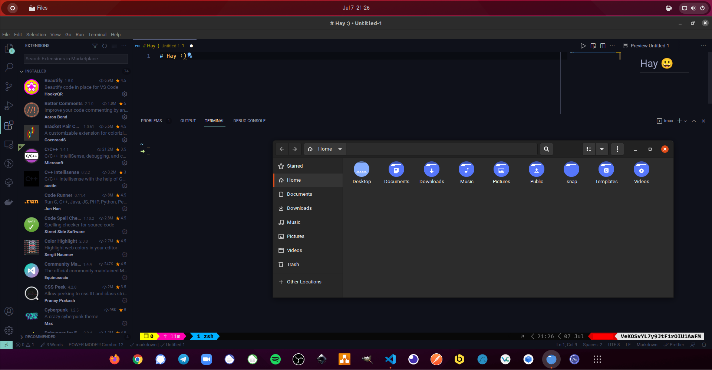

# Ansible Env Setup

```sh
    MVladislav
```

---

- [Ansible Env Setup](#ansible-env-setup)
  - [clone](#clone)
  - [install](#install)
  - [setup](#setup)
    - [device](#device)
    - [ssh-key](#ssh-key)
  - [run](#run)
    - [setup a client](#setup-a-client)
    - [setup a server](#setup-a-server)
  - [Other](#other)

---



**client installer runs around `1h`**

## clone

clone this repo recursive, because the roles are</br>
included as submoduls

```sh
$git clone --recursive https://github.com/MVladislav/ansible-env-setup.git
```

to load or update submodules run:

```sh
: 'load'
$git submodule update --init --recursive
: 'update'
$git submodule update --recursive --remote
```

## install

install Ansible on host to run the playbook

```sh
$sudo apt install python3 python3-pip sshpass
: 'optional: openssh-sftp-server'
$python3 -m pip install Ansible
$python3 -m pip install molecule[docker] ansible-lint
```

## setup

### device

copy `inventory/inventory-example.yml` to `inventory/inventory.yml`</br>
`$cp inventory/inventory-example.yml inventory/inventory.yml`

add the device information into: `inventory/inventory.yml`

from default the base setup is defined in each file:

- `playbooks/playbook-client.yml`
- `playbooks/playbook-server.yml`

if needed you can update this, like you need to install services.

### ssh-key

copy `playbooks/vars/default-example.yml` to `playbooks/vars/default.yml`</br>
`$cp playbooks/vars/default-example.yml playbooks/vars/default.yml`

every setup will add a **ssh-key** to the **nodes**, for that</br>
you need to add a **ssh-pub-key** into `playbooks/vars/default.yml`</br>
where the **key**, in the file, will be selected by: `"{{ ansible_user }}-{{ ansible_host }}"`.

this will be done in: `playbooks/tasks/pre-tasks.yml`

## run

### setup a client

> HINT: change `playbooks/playbook-client.yml` in example command, in what ever you want to run

on first run:

> `-k` => will use **ssh with a password**, as a fresh setup has no **ssh-key**

```sh
$ansible-playbook playbooks/playbook-client.yml --ask-become-pass -k
```

on other runs (because ssh is/should be configured with ssh-key):

```sh
$ansible-playbook playbooks/playbook-client.yml --ask-become-pass
```

### setup a server

> HINT: change `playbooks/playbook-server.yml` in example command, in what ever you want to run

on first run:

> `-k` => will use **ssh with a password**, as a fresh setup has no **ssh-key**

```sh
$ansible-playbook playbooks/playbook-server.yml --ask-become-pass -k
```

on other runs:

```sh
$ansible-playbook playbooks/playbook-server.yml --ask-become-pass
```

---

## Other

change username at once with current user:

> change
>
> - <newname>
> - <oldname>

```sh
$sudo su
$nohup bash -c "groupadd <newname> ; pkill -u <oldname> ; usermod -d /home/<newname> -m -g <newname> -l <newname> <oldname>" </dev/null &>/dev/null &
```
