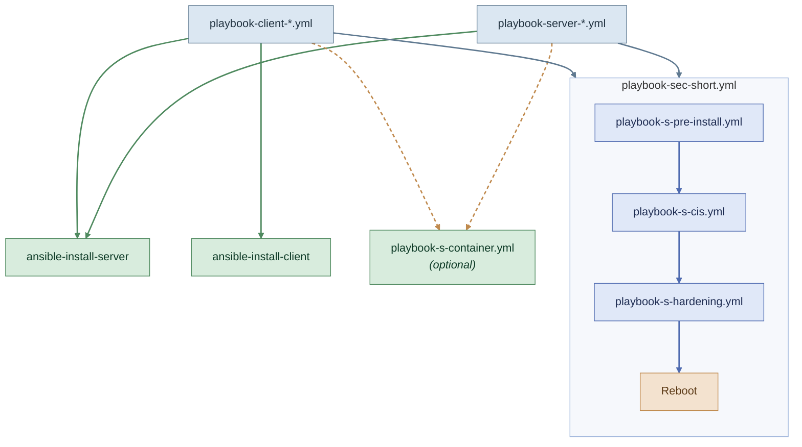
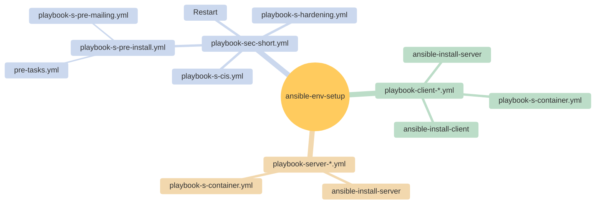

# Ansible Env Setup

[](https://github.com/MVladislav/ansible-env-setup/actions/workflows/ansible-lint.yml)

Ansible playbook and role collection to install, configure and **harden Ubuntu** client devices and server instances with
best-practice security defaults.

The project is organized in two layers:

- **Shared service playbooks** (`playbook-s-*.yml`) - CIS hardening, pre-install, hardening services (updater, UFW, auditd,
  fail2ban, ...), mailing and containers. They are combined by `playbook-sec-short.yml`, which can be run standalone on **any**
  device (client or server), so every setup gets the same security baseline without duplicated definitions.
- **Client / server playbooks** (`playbook-client-*.yml`, `playbook-server-*.yml`) - per-profile setups that run the security
  baseline and then install the actual tools and applications on top.

## Flow

Every playbook starts with the security baseline (`playbook-sec-short.yml`), which runs the three `playbook-s-*` phases in order
and reboots at the end. Depending on the playbook, the install roles run after the baseline:


```mermaid
flowchart TD
    classDef entry fill:#dbe7f2,stroke:#5f7990,color:#223341
    classDef phase fill:#e0e8f8,stroke:#4f6bb0,color:#1e2c52
    classDef install fill:#d8ecdd,stroke:#4f8a5f,color:#0d3a26
    classDef reboot fill:#f3e2cf,stroke:#c08a4e,color:#5c3a16

    C["playbook-client-*.yml"]:::entry
    S["playbook-server-*.yml"]:::entry

    subgraph SEC["playbook-sec-short.yml"]
        direction TB
        PRE["playbook-s-pre-install.yml"]:::phase
        CIS["playbook-s-cis.yml"]:::phase
        HARD["playbook-s-hardening.yml"]:::phase
        BOOT["Reboot"]:::reboot
        PRE --> CIS --> HARD --> BOOT
    end

    I1["ansible-install-server"]:::install
    I2["ansible-install-client"]:::install
    CONT["playbook-s-container.yml<br/><i>(optional)</i>"]:::install

    C --> SEC
    S --> SEC
    C --> I1
    C --> I2
    S --> I1
    C -.-> CONT
    S -.-> CONT

    linkStyle 0,1,2 stroke:#4f6bb0,stroke-width:2px
    linkStyle 3,4 stroke:#5f7990,stroke-width:2px
    linkStyle 5,6,7 stroke:#4f8a5f,stroke-width:2px
    linkStyle 8,9 stroke:#c08a4e,stroke-width:2px,stroke-dasharray:5 4

    style SEC fill:#f6f8fc,stroke:#9db4db,stroke-width:1px
```

What each box contains:

| Box                          | Contents                                                                                                                                        |
| ---------------------------- | ----------------------------------------------------------------------------------------------------------------------------------------------- |
| `playbook-s-pre-install.yml` | - `pre-tasks.yml` (ssh-key, hostname, python3, users)<br>- `playbook-s-pre-mailing.yml` (postfix / nullmailer)                                  |
| `playbook-s-cis.yml`         | - `ansible-cis-ubuntu-2204` / `ansible-cis-ubuntu-2404` (auto-selected by distribution)<br>- aide environment                                   |
| `playbook-s-hardening.yml`   | - `ansible-updater` (time, language, unattended)<br>- UFW<br>- `ansible-security` (auditd, failban, usbguard, snmp, ssh)<br>- `ansible-netplan` |
| `ansible-install-server`     | base tools, apt/snap packages, git, zsh, tmux, nvim, python, go, npm                                                                            |
| `ansible-install-client`     | GNOME setup, desktop apps (snap, flatpak, dpkg), firefox tuning                                                                                 |
| `playbook-s-container.yml`   | only run by playbooks that install containers<br>- `ansible-docker` (CIS arm-hardened)<br>- `ansible-kubernetes` (k3s)                          |

As a compact structural overview, the same content as a mermaid mindmap:


```mermaid
%%{init: {"theme":"base","themeVariables":{"cScale1":"#cbd8ee","cScale2":"#bcddc8","cScale3":"#f2d8ae","cScale4":"#eef2f5","cScale5":"#eef2f5","cScale6":"#eef2f5"}} }%%
mindmap
  root((ansible-env-setup))
    playbook-sec-short.yml
      playbook-s-pre-install.yml
        pre-tasks.yml
        playbook-s-pre-mailing.yml
      playbook-s-cis.yml
      playbook-s-hardening.yml
      Restart
    playbook-client-*.yml
      ansible-install-server
      ansible-install-client
      playbook-s-container.yml
    playbook-server-*.yml
      ansible-install-server
      playbook-s-container.yml
```

An editable source of this flow is stored as `docs/Playbook Sec Short.excalidraw`.

## Repository layout

```
├── ansible.cfg                      # ansible configuration, inventory = ./inventory/
├── inventory/
│   ├── inventory-default.yml        # shared defaults, merged for every host
│   ├── inventory-example-client.yml # template for a client device
│   └── inventory-example-server.yml # template for a server instance
├── playbooks/
│   ├── playbook-sec-short.yml       # security baseline: PRE + CIS + Hardening + reboot
│   ├── playbook-s-*.yml             # shared service playbooks
│   ├── playbook-client-*.yml        # client setups
│   ├── playbook-server-*.yml        # server setups
│   └── pre-tasks.yml                # first-run essentials on the target
├── roles/                           # ansible roles, included as git submodules
└── requirements.yml                 # required ansible collections
```

All roles live in their own repositories and are included as git submodules. The two install roles (`ansible-install-server`,
`ansible-install-client`) document their full application lists:

- [ansible-install-server](https://github.com/MVladislav/ansible-install-server) - tools for server usage (also used for clients)
- [ansible-install-client](https://github.com/MVladislav/ansible-install-client) - tools and GUI applications for clients
- [ansible-security](https://github.com/MVladislav/ansible-security) - auditd, fail2ban, usbguard, snmp, ssh
- [ansible-updater](https://github.com/MVladislav/ansible-updater) - time, language, unattended upgrades
- [ansible-cis-ubuntu-2204](https://github.com/MVladislav/ansible-cis-ubuntu-2204) /
  [ansible-cis-ubuntu-2404](https://github.com/MVladislav/ansible-cis-ubuntu-2404) - CIS benchmarks
- [ansible-docker](https://github.com/MVladislav/ansible-docker),
  [ansible-kubernetes](https://github.com/MVladislav/ansible-kubernetes),
  [ansible-netplan](https://github.com/MVladislav/ansible-netplan)
- [ansible-postfix](https://github.com/Oefenweb/ansible-postfix) - mailing

## Requirements

Ansible runs from your control host (laptop/workstation), not on the targets. The targets only need SSH access and a `python3`
(installed automatically by `pre-tasks.yml` if missing).

```sh
sudo apt install python3 python3-pip python3-venv libssl-dev sshpass
git clone --recursive https://github.com/MVladislav/ansible-env-setup.git
cd ansible-env-setup

python3 -m venv .venv && source .venv/bin/activate
python3 -m pip install ansible-core ansible-lint yamllint
ansible-galaxy collection install --upgrade -r requirements.yml
```

Update the role submodules with:

```sh
git submodule update --init --recursive        # initial clone
git submodule update --recursive --remote      # update to latest
```

### [Optional] Molecule for role tests

```sh
python3 -m pip install molecule molecule-plugins[docker]
```

## Quick start

### 1. Create a per-device inventory

Copy the matching example to a **per-device** file and adjust it. Your local file is ignored by git, so keys and password hashes
stay local:

```sh
cp inventory/inventory-example-server.yml inventory/server1.yml
# edit inventory/server1.yml: ssh key, public key, user, ip, hostname, ...
```

The shared defaults in `inventory/inventory-default.yml` are merged automatically for every host (see `ansible.cfg`). A per-device
inventory only needs the host-specific values:

```yml
all:
  hosts:
    server1:
      ansible_ssh_private_key_file: ~/.ssh/id_ed25519
      pl_a_setup_ssh_pub_key: "ssh-ed25519 AAAA... user@host"
      ansible_user: myuser
      ansible_host: 192.168.0.10
      ansible_host_hostname: server1
      pl_a_host_default_dns: 9.9.9.9
      pl_a_host_default_ntp: ntp.ubuntu.com
      pl_a_host_fallback_ntp: ntp.hetzner.de
      pl_a_apt_modern_src: false
      pl_a_cis_user_namespace_support: true
      pl_a_user_config:
        is_update: true
        password: "$6$..." # sudo apt install whois && mkpasswd --method=sha-512
        group: sudo,adm,dip,lxd,plugdev
      pl_a_clients:
        - name: "{{ ansible_user }}"
          dev: true
          setup: true
  children:
    servers:
      hosts:
        server1:
```

### 2. Run a playbook

> All `*.yml` files in `inventory/` are merged into one inventory. To install **one device at a time**, always pass
> `--limit <host>` - otherwise plays that target `hosts: all` (e.g. the reboot in `playbook-sec-short.yml`) run against **every**
> device in the inventory.

```sh
# install a single device: defaults from inventory-default.yml are merged automatically
ansible-playbook playbooks/playbook-server-minimal.yml --ask-become-pass -k --limit server1

# security baseline only, runnable standalone on any device
ansible-playbook playbooks/playbook-sec-short.yml --ask-become-pass -k --limit server1

# -k asks for the SSH password (fresh device without ssh-key), --ask-become-pass for sudo
```

If you do pass `-i` on the command line, it **replaces** the inventory configured in `ansible.cfg` - the shared defaults are then
no longer merged automatically. In that case pass both files explicitly:

```sh
ansible-playbook playbooks/playbook-sec-short.yml \
  -i inventory/inventory-default.yml -i inventory/inventory-example-server.yml --ask-become-pass -k
```

## Playbooks

### Security baseline - `playbook-sec-short.yml`

Combines the shared service playbooks for any host and reboots at the end. All client/server playbooks import it, but it can be
run standalone:

1. `playbook-s-pre-install.yml` - user setup (ssh-key, hostname, python3, user accounts) and mailing
2. `playbook-s-cis.yml` - CIS hardening for Ubuntu 22.04/24.04 (selected by distribution), plus aide environment
3. `playbook-s-hardening.yml` - updater (time, language, unattended upgrades), UFW, security services (auditd, fail2ban, usbguard,
   snmp, ssh), netplan
4. Restart the system and wait for it to come back

### Shared service playbooks

| Playbook                     | Target             | Purpose                                                         |
| ---------------------------- | ------------------ | --------------------------------------------------------------- |
| `playbook-s-pre-install.yml` | all                | pre-tasks + mailing setup                                       |
| `playbook-s-cis.yml`         | clients, servers   | CIS Ubuntu 22.04 / 24.04 hardening + aide                       |
| `playbook-s-hardening.yml`   | all                | updater, UFW, security services, netplan                        |
| `playbook-s-container.yml`   | docker, kubernetes | docker (CIS hardened) + kubernetes (k3s)                        |
| `playbook-s-pre-mailing.yml` | all                | postfix / nullmailer setup                                      |
| `pre-tasks.yml`              | all                | first-run essentials: python3, ssh-key, hostname, user accounts |

### Client playbooks (host group `clients`)

All run the security baseline, then install server tools and client tools according to the profile:

| Playbook                         | Profile                                                      |
| -------------------------------- | ------------------------------------------------------------ |
| `playbook-client.yml`            | default desktop: GNOME, common apps                          |
| `playbook-client-vm.yml`         | desktop in a VM: guest agent, archive/dev tools, latex, nmap |
| `playbook-client-dev.yml`        | developer desktop: node, go, httpie, python dev stack        |
| `playbook-client-pentest.yml`    | pentest desktop: nmap, john the ripper, ghidra, zaproxy, ... |
| `playbook-client-n-normal.yml`   | newer default desktop variant                                |
| `playbook-client-n-extended.yml` | newer extended variant, includes container tools             |

### Server playbooks (host group `servers`)

All run the security baseline, then install server tools and containers:

| Playbook                      | Profile                                                     |
| ----------------------------- | ----------------------------------------------------------- |
| `playbook-server-minimal.yml` | minimal: base tools, git, zsh/tmux/nvim, python, containers |
| `playbook-server-dev.yml`     | dev: full apt/dev toolchain, python, npm, containers        |
| `playbook-server-cluster.yml` | cluster: kubernetes (k3s) nodes, no extra tooling           |

The full application matrices per profile are documented in the role READMEs:
[ansible-install-server](https://github.com/MVladislav/ansible-install-server),
[ansible-install-client](https://github.com/MVladislav/ansible-install-client).

## Inventory configuration

### How the inventory is merged

`ansible.cfg` sets `inventory = ./inventory/`. Every `*.yml` file in the directory is parsed and merged (the
`inventory-example-*.yml` files are excluded via `ignore_patterns`). This means:

- `inventory/inventory-default.yml` - shared `all.vars` defaults for every host
- your per-device files (`inventory/server1.yml`, `inventory/server2.yml`, `inventory/client1.yml`, ...) - only the values that
  differ per device

**Important:** all files are merged into one inventory. If `server1.yml` and `server2.yml` both exist, both hosts are active. Use
`--limit <host>` to install only one device. A `-i` argument on the command line replaces the configured inventory entirely -
include `inventory/inventory-default.yml` in that case.

Host variables override the shared defaults. **Exception:** dict variables (`pl_a_user_config`, `pl_a_clients`, ...) must be
defined completely in the per-device file, since per-host values replace - not merge - the default dict.

### Common per-device variables

These are the values that usually differ per device and belong in the per-device inventory:

| Variable                             | Default / example     | Description                                                        |
| ------------------------------------ | --------------------- | ------------------------------------------------------------------ |
| `ansible_ssh_private_key_file`       | `~/.ssh/id_ed25519`   | private key used to connect                                        |
| `pl_a_setup_ssh_pub_key`             | `ssh-ed25519 AAAA...` | public key deployed to the device (`pre-tasks.yml`)                |
| `ansible_user`                       | `myuser`              | SSH user on the target                                             |
| `ansible_host`                       | `192.168.0.10`        | IP address or FQDN of the target                                   |
| `ansible_host_hostname`              | `server1`             | hostname to set on the target                                      |
| `install_server_git_user`            | `{{ ansible_user }}`  | git user for `ansible-install-server`                              |
| `install_server_git_email`           | `{{ ansible_user }}`  | git email for `ansible-install-server`                             |
| `pl_a_host_default_dns`              | `9.9.9.9`             | primary DNS server                                                 |
| `pl_a_host_default_ntp`              | `ntp.ubuntu.com`      | NTP server                                                         |
| `pl_a_host_fallback_ntp`             | `ntp.hetzner.de`      | fallback NTP server                                                |
| `pl_a_apt_modern_src`                | `false`               | use the modern `sources.d` apt layout                              |
| `pl_a_user_config.password`          | sha-512 hash          | password hash of `ansible_user` (`mkpasswd --method=sha-512`)      |
| `pl_a_cis_user_namespace_support`    | `true`                | docker user namespaces (CIS docker rule 2.10)                      |
| `pl_a_set_boot_pass`                 | `false`               | set a grub bootloader password (CIS 1.4.2 / 1.5.2)                 |
| `cis_ubuntu2404_bootloader_password` | `"random"`            | bootloader password hash, needed if `pl_a_set_boot_pass` is `true` |

### Shared defaults - `inventory-default.yml`

The defaults are organized by section and documented inline in the file. Overview:

| Section                | Variables (default)                                                                                     |
| ---------------------- | ------------------------------------------------------------------------------------------------------- |
| Connection             | `ansible_python_interpreter` (`/usr/bin/python3`), `ansible_port` (`22`)                                |
| Service name           | `pl_a_service_name` (`{{ inventory_hostname }}_{{ ansible_user }}`)                                     |
| Time & location        | `pl_a_time_synchronization_service` (`chrony`), `updater_time_timezone` (`Europe/Berlin`), NTP refs     |
| SSH                    | `pl_a_ssh_setup` (`true`), `security_ssh_only_client_setup` (`true`)                                    |
| UFW                    | `pl_a_ufw_setup_enable` (`true`), `pl_a_ufw_logging_level` (`medium`)                                   |
| SNMP                   | `pl_a_snmp_setup` (`false`) + `security_snmp_*` credentials                                             |
| CIS                    | `pl_a_cis_setup` (`true`), `pl_a_cis_setup_aide` (`false`), `pl_a_cis_ipv6_required` (`true`)           |
| Mailing                | `pl_a_mailing_*` (relay host `home.local`, port `587`, STARTTLS)                                        |
| Hardening scan (Lynis) | `pl_a_hardening_scan_setup` (`false`) + report recipients                                               |
| Security services      | `pl_a_auditd_setup` (`true`), `pl_a_fail2ban_setup` (`true`), `pl_a_usbguard_setup` (`false`)           |
| Docker                 | `pl_a_cis_is_swarm_mode` (`true`), `pl_a_cis_init_swarm_mode` (`true`), `cis_docker_rule_2_1` (`false`) |
| Netplan (optional)     | disabled by default, commented example with NetworkManager in the file                                  |

## Adding a new device or playbook

**New device:** copy the example and adjust the per-device values (see above). Add the host to the groups the playbooks should run
against (`clients` / `servers` / `docker` / `kubernetes`). Run `ansible-inventory --list` to verify the merged result, and
`ansible-inventory --list --limit <host>` to verify a single device. All per-device files are merged - target single devices with
`--limit <host>`.

**New playbook:** the client/server playbooks import `playbook-sec-short.yml` and then run the install roles with a profile
config. To add a profile, copy an existing playbook (e.g. `playbook-client.yml`) and adjust the `install_server_config` /
`install_client_config` flags - the full list of available flags is in the
[role defaults](https://github.com/MVladislav/ansible-install-client) of the install roles. New shared steps should be added as
`playbook-s-*` and imported into `playbook-sec-short.yml` so every setup inherits them.

## Troubleshooting

| Problem                                                     | Solution                                                                                       |
| ----------------------------------------------------------- | ---------------------------------------------------------------------------------------------- |
| `provided hosts list is empty, only localhost is available` | no inventory found in `inventory/` - create your per-device file first                         |
| Playbook runs against **all** devices instead of one        | add `--limit <host>` to the command                                                            |
| CIS / hardening silently skipped when using `-i`            | a `-i` argument replaces the configured inventory - pass `inventory/inventory-default.yml` too |
| SSH connection fails on a fresh device (`-k` ignored)       | the device has no `python3` yet - `pre-tasks.yml` installs it, this is normal on the first run |
| Connection reset / no host key after reboot                 | the security playbook reboots the device at the end - wait and rerun                           |
| Playbook skips CIS hardening                                | `pl_a_cis_setup` is not set - it defaults to `true` via `inventory-default.yml`                |
| New role added, playbook not found                          | `git submodule update --init --recursive` was not run after cloning                            |
| Host key changed after reinstall                            | `host_key_checking` is disabled in `ansible.cfg`; verify manually if you expect MITM risk      |
| More than one user or a user without sudo needed            | extend `pl_a_clients` in the per-device inventory (see `pre-tasks.yml`)                        |

## Security

See [SECURITY.md](SECURITY.md) for the security policy. Password hashes and ssh keys should only be placed in your (gitignored)
per-device inventories.

## License

See [LICENCE](LICENCE).
